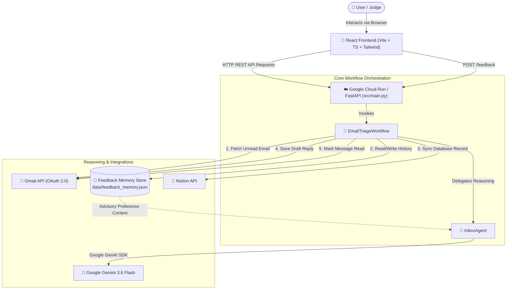

# InboxPilot — Autonomous AI Email Triage Assistant ✈️📧

> **An autonomous, preference-aware AI email triage assistant powered by Google Gemini 3.6 Flash, Google GenAI SDK, Gmail API, and Notion. InboxPilot continuously monitors incoming emails, evaluates urgency, generates reply drafts, synchronizes actionable workspace intelligence to Notion, and learns user preferences from feedback.**

[](https://python.org)
[](https://fastapi.tiangolo.com)
[](https://react.dev)
[](https://ai.google.dev)
[](https://pypi.org/project/google-genai/)
[](https://developers.google.com/gmail/api)
[](https://developers.notion.com)
[](https://cloud.google.com/run)

---

## 🏆 Hackathon Requirements Compliance

InboxPilot was built specifically to demonstrate Google AI technologies, agentic architectures, and modern cloud deployment standards.

| Component | Technology | Implementation & Usage Location |
| :--- | :--- | :--- |
| **AI Model** | **Google Gemini 3.6 Flash** | Core reasoning engine performing multi-dimensional classification, urgency scoring, spam detection, and reply draft generation. (`src/agent/inbox_agent.py`) |
| **Google Agent Framework** | **Google GenAI SDK** (`google-genai`) | Official Python client library (`from google import genai`) used for structured JSON prompting, response parsing, and error fallback handling. (`src/agent/inbox_agent.py`) |
| **Cloud Infrastructure** | **Google Cloud Run** | Intended production containerized deployment target for the FastAPI backend service and polling workflow. (`Dockerfile`, `src/main.py`) |
| **Email Integration** | **Gmail API** | OAuth 2.0 message polling (`q="is:unread"`), read-marking (`removeLabelIds: ["UNREAD"]`), and Gmail Draft reply creation. (`src/gmail/gmail_service.py`) |
| **Workspace Sync** | **Notion API** | Real-time database record creation mapping email metadata, summary, category, priority, and draft indicators. (`src/notion/notion_service.py`) |

---

## 📖 Overview

**InboxPilot** transforms email overload into an autonomous, self-improving workflow. Operating as a continuous background agent, InboxPilot:
- 📩 **Monitors unread emails** via official Gmail OAuth 2.0 integration.
- 🧠 **Classifies and prioritizes messages** across 9 categories and 3 priority levels using Google Gemini 3.6 Flash and the Google GenAI SDK.
- ✍️ **Generates professional reply drafts** saved directly into Gmail Drafts for human review before sending.
- 📊 **Synchronizes structured email records** into a live Notion workspace dashboard.
- 🎓 **Learns user preferences** over time from manual feedback corrections without retraining models.
- 🛑 **Prevents duplicate processing** by automatically marking processed messages as read (`removeLabelIds: ["UNREAD"]`) upon workflow completion.
- 🎨 **Provides a modern React dashboard** with real-time autonomous monitoring indicators and a 15-second auto-poll toggle.

---
## Live Deployment

Backend Health Endpoint:

https://inboxpilot-git-670118578173.asia-south1.run.app/health

Status: Deployed on Google Cloud Run

## 🚨 Problem Statement

Modern professionals suffer from severe **inbox fatigue**:
- 📥 **Email Deluge**: Hundreds of emails flood inboxes daily, mixing urgent requests with newsletters, promotions, and spam.
- 🔍 **Buried Priority**: Critical time-sensitive inquiries (e.g., job interview invitations, client requests, bank alerts) get lost in low-priority noise.
- ⏳ **Time Sink**: Manual email triage and repetitive draft composition consume hours of productive work every day.
- 🔄 **Fragmented Context**: Switching between email clients, task managers, and response drafts fragments focus and workflow continuity.

---

## 💡 The Solution

InboxPilot provides a **fully integrated, preference-aware autonomous agent**:

1. **AI-Powered Triage**: Evaluates each unread message using Google Gemini 3.6 Flash to compute urgency scores, primary category, spam risk, summary, and classification reasoning.
2. **Preference-Aware Context**: Injects historical user feedback statistics into Gemini reasoning prompts so the AI adapts to individual user preferences while keeping current content as primary truth.
3. **Safe Human-In-The-Loop Drafting**: Generates contextually relevant response drafts saved strictly to Gmail Drafts — emails are **never** automatically sent without human authorization.
4. **Unified Notion Workspace**: Automatically logs triaged emails, status badges, summaries, and draft indicators into a centralized Notion database.
5. **Real-time Glassmorphism Dashboard**: A dark-mode React web dashboard for reviewing analyzed messages, viewing integration status, and submitting feedback corrections with instant memory persistence.

---

## ✨ Features

- 🔐 **Real Gmail OAuth 2.0 Integration**: Secure credentials loading, token reuse, automatic refresh, and message metadata parsing.
- ⚡ **Gemini 3.6 Flash Reasoning**: High-speed, structured JSON email classification powered by the official `google-genai` SDK.
- 🏷️ **9-Category Classification**: `ACTION_REQUIRED`, `MEETING`, `APPLICATION`, `FINANCE`, `NEWSLETTER`, `PROMOTION`, `SPAM_SCAM`, `PERSONAL`, and `OTHER`.
- 🚥 **3-Tier Urgency Scoring**: `HIGH`, `MEDIUM`, and `LOW` priority tags.
- 🛡️ **Spam & Scam Detection**: 0%–100% risk scoring to isolate phishing attempts and fraudulent offers.
- 📝 **Automated Reply Drafting**: Generates professional draft responses saved directly into Gmail Drafts.
- 📓 **Notion Workspace Sync**: Real-time property mapping to Notion database pages.
- 🧠 **User Feedback Memory**: Persistent JSON storage (`data/feedback_memory.json`) capturing priority/category corrections.
- 📊 **Preference-Aware Reasoning**: Injects sender preference statistics (`Preferred Priority`, `Confidence`, `Feedback Count`) as advisory context into Gemini prompts.
- 🔁 **Duplicate Processing Prevention**: Automatically marks processed Gmail messages as read to ensure idempotent execution.
- 📡 **Autonomous Monitoring Dashboard**: Real-time waiting card with interactive 15-second auto-polling toggle for live demos.
- 👤 **Human-in-the-Loop Safety**: Mandatory manual review before any email is dispatched.

---

## 📸 Interface Preview

<!-- DASHBOARD SCREENSHOT PLACEHOLDER -->
<!-- Insert main InboxPilot React Dashboard screenshot here -->

*InboxPilot Autonomous Dashboard displaying triaged email details, urgency badges, integration status, and reply draft preview.*

<!-- FEEDBACK CORRECTION PLACEHOLDER -->
<!-- Insert Feedback Submission Form screenshot here -->

*Human-in-the-Loop Feedback Submission panel for recording priority and category corrections.*

<!-- NOTION DASHBOARD PLACEHOLDER -->
<!-- Insert Notion Database Screenshot here -->

*Notion workspace database automatically synchronized with email classifications, priorities, summaries, and draft status.*

---

## 🛠️ Tech Stack

| Category | Technology | Usage Description |
| :--- | :--- | :--- |
| **Frontend** | **React 18** + **TypeScript** + **Vite** | Dark-mode glassmorphic single-page web dashboard (`frontend/`) |
| **Styling** | **Tailwind CSS** + **Lucide Icons** | Utility-first responsive design, glowing badges, and status icons |
| **Backend** | **Python 3.11+** + **FastAPI** | High-performance ASGI REST API server (`src/main.py`) |
| **AI Model** | **Google Gemini 3.6 Flash** | Advanced multi-dimensional email reasoning model |
| **AI SDK** | **Google GenAI SDK** (`google-genai`) | Official Python client library for Gemini model interactions |
| **Email Service** | **Gmail API (OAuth 2.0)** | Message querying, read marking, and Gmail draft creation |
| **Productivity** | **Notion API** (`notion-client`) | Automated workspace database synchronization |
| **Memory Store** | **Local Persistent JSON** | Feedback correction storage (`data/feedback_memory.json`) |
| **Deployment Target** | **Google Cloud Run** | Intended production containerized cloud hosting architecture |
| **Testing** | **Pytest** | Automated unit test suite (`tests/`) |

---

## 🏗️ Architecture Diagrams

### Diagram 1: High-Level System Architecture



---

### Diagram 2: End-to-End Email Lifecycle & Learning Loop

```mermaid
flowchart LR
    A["📩 New Gmail Email"] --> B["📥 Unread Retrieval (q='is:unread')"]
    B --> C["🧠 Query Sender Preference History"]
    C --> D["🤖 Gemini 3.6 Flash Reasoning"]
    D --> E["🚥 Urgency & Priority Detection"]
    E --> F["🏷️ Category Classification"]
    F --> G["📝 Reply Draft Generation"]
    G --> H["📓 Notion Workspace Sync"]
    H --> I["✅ Mark Gmail Read (UNREAD removed)"]
    I --> J["🎨 Dashboard Display"]
    J --> K["👤 Human Review / Feedback"]
    K --> L["💾 Preference Memory Updated"]
    L -.->|Future Advisory Context| C
```



---

## 🤖 Autonomous Agent Behaviour

InboxPilot operates strictly as an **autonomous agentic pipeline** following an Observe-Reason-Act loop:

### 1. Inbox Monitoring & Retrieval
The workflow periodically queries the Gmail API for unread messages (`q="is:unread"`). When a message is detected, metadata and body content are fetched for processing.

### 2. Preference Querying & AI Reasoning
Before querying Gemini, `InboxAgent` fetches historical sender correction statistics from the memory store. If feedback exists, sender statistics (`Preferred Priority`, `Confidence`, `Feedback Count`) are injected into the Gemini prompt as **advisory context**. Gemini 3.6 Flash evaluates the email and produces a structured JSON output containing category, priority, spam score, summary, and justification reasoning.

### 3. Multi-Step Execution
- **Notion Synchronization**: Creates a new database record in Notion populated with triage attributes.
- **Gmail Reply Drafting**: If action is required and a reply is appropriate, a response draft is saved directly into the user's Gmail Drafts folder.
- **Duplicate Prevention**: Calls `mark_as_read(email.id)` via Gmail API to remove the `UNREAD` label, guaranteeing the message is never reprocessed.

### 4. Human-In-The-Loop & Memory Learning
Users review triaged messages on the React dashboard. If a user submits a priority or category correction, the memory module records the feedback. Subsequent emails from that sender benefit from advisory preference context.

> [!IMPORTANT]
> **Safety Guarantee**: Response drafts are created in **Gmail Drafts** only. Emails are **NEVER** sent automatically. Human review and manual dispatch remain mandatory.

---

## 🎨 Frontend Web Dashboard

The frontend application (`frontend/`) is a modern dashboard built with **React 18**, **TypeScript**, **Vite**, and **Tailwind CSS**.

### Key UI Features
- **Glassmorphic Navigation Bar**: Brand identity, active AI status pill, and manual refresh trigger.
- **Analyzed Email Card**: Subject line, sender/recipient badges, and received date timestamp.
- **Triage Badges**: Color-coded category badge, 3-tier priority badge, and spam risk percentage meter.
- **Integration Status Cards**: Live indicators for Notion Sync (`Synced`), Gmail Draft (`Draft Saved`), and Memory Preference (`Memory Context Used` vs `No Preference History`).
- **AI Summary & Reasoning Accordion**: Concise summary block and expandable Gemini classification reasoning block.
- **Draft Reply Box**: Interactive reply draft preview with a 1-click clipboard copy button.
- **Feedback Correction Panel**: Priority & category dropdowns, rationale text area, and submit button displaying an instant `✓ Feedback saved to memory repository!` notification.
- **Autonomous Monitoring Active Card**: Rendered when all unread emails have been processed, featuring a glowing pulse animation, last checked timestamp, and an interactive **Auto-Poll (15s): ON/OFF** toggle.

---

## 📂 Repository Structure

```text
InboxPilot/
├── src/
│   ├── agent/
│   │   ├── exceptions.py             # Custom agent exception classes
│   │   ├── inbox_agent.py            # Gemini 3.6 Flash agent with retry & fallback
│   │   └── prompts.py                # Structured system, user & preference prompts
│   ├── config/
│   │   └── settings.py               # Pydantic Settings configuration loader
│   ├── gmail/
│   │   └── gmail_service.py          # Gmail OAuth 2.0 auth, read-marking & draft creation
│   ├── memory/
│   │   ├── feedback_memory.py        # Local JSON feedback storage
│   │   ├── memory_service.py         # Memory orchestrator module
│   │   └── user_preferences.py       # Sender preference statistics compiler
│   ├── models/
│   │   └── email_models.py           # Pydantic data schemas (Email, TriageResult, Feedback)
│   ├── notion/
│   │   └── notion_service.py         # Notion database SDK integration
│   ├── workflows/
│   │   └── email_triage_workflow.py  # End-to-end triage workflow orchestrator
│   └── main.py                       # FastAPI application entrypoint
│
├── frontend/                         # React + Vite + TypeScript web dashboard
│   ├── src/
│   │   ├── App.tsx                   # Main glassmorphism UI component
│   │   ├── index.css                 # Tailwind imports & glow animations
│   │   ├── types.ts                  # TypeScript interface definitions
│   │   └── main.tsx                  # React entrypoint
│   ├── package.json
│   ├── tailwind.config.js
│   └── vite.config.ts                # Vite config with backend proxy (/api)
│
├── scripts/                          # Standalone verification & test scripts
│   ├── test_gmail_connection.py      # Gmail OAuth connection test
│   ├── test_email_triage.py          # Gemini email triage test
│   ├── test_notion_integration.py    # Notion page creation test
│   ├── test_gmail_draft_creation.py  # Gmail draft reply creation test
│   ├── test_feedback_memory.py       # Memory storage test
│   ├── test_preference_aware_analysis.py # Preference-aware classification test
│   └── test_bugfix_validation.py     # Duplicate prevention & read-marking test
│
├── tests/                            # Pytest test suite
│   ├── test_inbox_agent.py
│   └── test_main.py
│
├── data/                             # Persistent memory store
│   └── feedback_memory.json
│
├── .env.example                      # Configuration template
├── credentials.json                  # Google OAuth credentials (User configured)
├── token.json                        # Gmail OAuth token cache (Generated)
├── requirements.txt                  # Python dependencies
└── README.md                         # Project documentation
```

---

## ⚙️ Local Setup Instructions

### 1. Environment & Virtual Env Setup

```powershell
# Clone repository
git clone https://github.com/itxmeBhawna/InboxPilot.git
cd InboxPilot

# Create Python virtual environment
python -m venv .venv

# Activate virtual environment
# Windows (PowerShell):
.venv\Scripts\Activate.ps1
# Linux / macOS:
source .venv/bin/activate
```

---

### 2. Install Backend Dependencies

```powershell
pip install -r requirements.txt
```

---

### 3. Install Frontend Dependencies

```powershell
cd frontend
npm install
cd ..
```

---

### 4. Environment Variables Configuration

Copy `.env.example` to `.env`:

```powershell
cp .env.example .env
```

Configure your `.env` variables:

```env
APP_NAME=InboxPilot
ENVIRONMENT=development
LOG_LEVEL=INFO

# Google Gemini API
GEMINI_API_KEY=your_gemini_api_key_here
GEMINI_MODEL=gemini-3.6-flash

# Gmail OAuth Settings
GMAIL_CREDENTIALS_FILE=credentials.json
GMAIL_TOKEN_FILE=token.json
GMAIL_USER_ID=me

# Notion Integration Settings
NOTION_API_KEY=your_notion_integration_secret_here
NOTION_DATABASE_ID=your_notion_database_id_here
```

---

### 5. Gmail OAuth Credentials Setup

1. Open [Google Cloud Console](https://console.cloud.google.com/).
2. Create a project and enable the **Gmail API**.
3. Configure the **OAuth Consent Screen** (Desktop App).
4. Create **OAuth 2.0 Client IDs** credentials.
5. Download credentials JSON and save as `credentials.json` in root directory.
6. Initial execution will prompt browser OAuth login and generate `token.json`.

---

### 6. Notion Database Integration Setup

1. Open [Notion Integrations](https://www.notion.so/my-integrations) and create an integration. Copy secret to `NOTION_API_KEY`.
2. Create a Notion database with properties: `Subject` (Title), `Sender` (Text), `Category` (Select), `Priority` (Select), `Spam Score` (Number), `Reply Needed` (Checkbox), `Summary` (Text), `Received At` (Date).
3. Share database with integration and set `NOTION_DATABASE_ID`.

---

### 7. Running Backend & Frontend

#### Backend Server
```powershell
.venv\Scripts\python.exe -m uvicorn src.main:app --port 8000 --reload
```
- **Backend API**: `http://localhost:8000`
- **Swagger Documentation**: [`http://localhost:8000/docs`](http://localhost:8000/docs)

#### Frontend Server
```powershell
cd frontend
npm run dev
```
- **React Web Dashboard**: [`http://localhost:5173`](http://localhost:5173)

---

### 8. Running Automated Tests

```powershell
pytest
```

---

## 🚢 Deployment Architecture

InboxPilot is designed for containerized deployment on **Google Cloud Run**.

### Intended Production Target: Google Cloud Run

```dockerfile
# Production Dockerfile
FROM python:3.11-slim

WORKDIR /app

COPY requirements.txt .
RUN pip install --no-cache-dir -r requirements.txt

COPY src/ ./src/
COPY data/ ./data/

EXPOSE 8000

CMD ["uvicorn", "src.main:app", "--host", "0.0.0.0", "--port", "8000"]
```

#### Deploying to Google Cloud Run:
```bash
# Build and submit image to Google Artifact Registry
gcloud builds submit --tag gcr.io/YOUR_PROJECT_ID/inboxpilot-backend

# Deploy container to Cloud Run
gcloud run deploy inboxpilot-backend \
    --image gcr.io/YOUR_PROJECT_ID/inboxpilot-backend \
    --platform managed \
    --region us-central1 \
    --allow-unauthenticated \
    --set-env-vars GEMINI_API_KEY=your_key,NOTION_API_KEY=your_notion_key,NOTION_DATABASE_ID=your_db_id
```

### Frontend Static Build Deployment

```bash
cd frontend
npm run build
```
Deploy generated `frontend/dist` static assets to **Vercel**, **Netlify**, or **Cloudflare Pages**, configuring rewrite proxy rules for API routes.

---

## 🎥 Demo Walkthrough Checklist

For video recordings and live judging demonstrations:

- [x] **1. New Email Arrival**: Sender transmits an unread email to connected Gmail inbox.
- [x] **2. AI Classification**: InboxPilot detects message, calling Gemini 3.6 Flash via `google-genai` SDK.
- [x] **3. Gemini Reasoning**: AI outputs structured category, priority, spam risk, and reasoning.
- [x] **4. Reply Draft Generation**: AI composes professional reply saved to Gmail Drafts.
- [x] **5. Notion Workspace Sync**: Live record creation in Notion database.
- [x] **6. Read Marking & Duplicate Prevention**: UNREAD label removed from Gmail message.
- [x] **7. Dashboard Display**: React UI displays triage card, status badges, and draft preview.
- [x] **8. Feedback Correction**: User submits priority/category correction on dashboard.
- [x] **9. Preference Learning**: Subsequent email analysis demonstrates advisory memory context usage (`Memory Context Used` badge).
- [x] **10. Autonomous Waiting State**: UI renders Autonomous Monitoring Active card with 15s auto-poll toggle.

---

## 📜 License

This project is licensed under the [MIT License](LICENSE).
