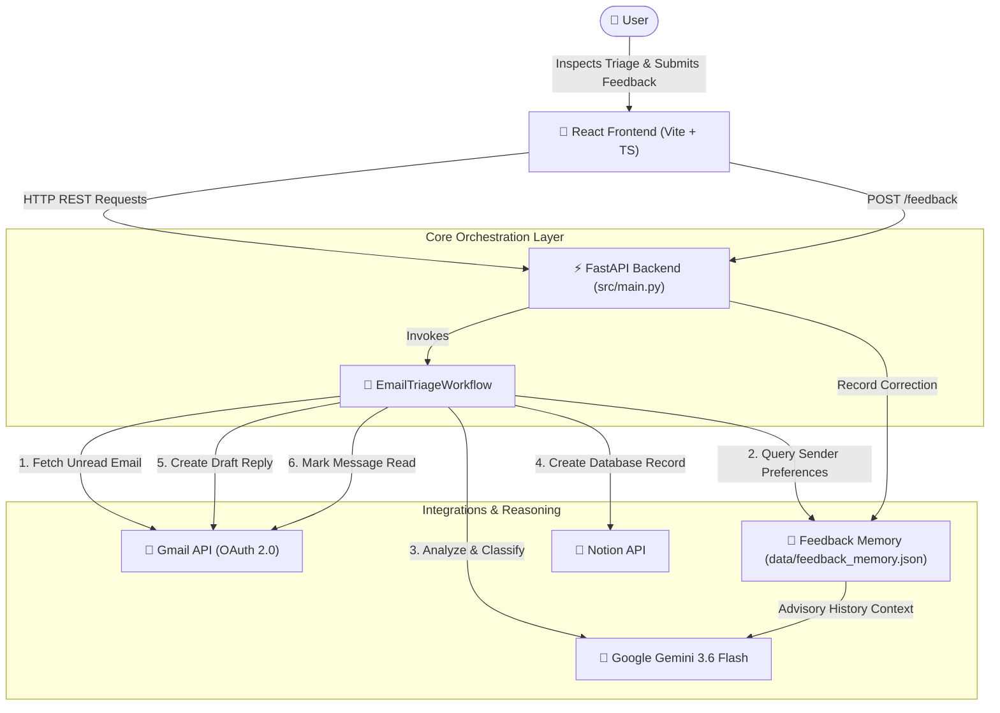
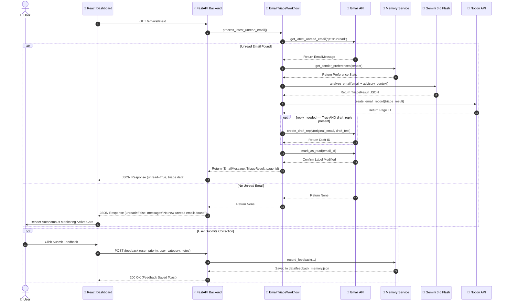

# InboxPilot — Autonomous AI Email Triage Assistant ✈️📧

> **Intelligent, preference-aware AI agent that autonomously monitors unread emails, evaluates urgency, drafts contextual replies, synchronizes actionable intelligence to Notion, and learns from user feedback.**

[](https://python.org)
[](https://fastapi.tiangolo.com)
[](https://react.dev)
[](https://ai.google.dev)
[](https://developers.google.com/gmail/api)
[](https://developers.notion.com)

---

## 📖 Overview

**InboxPilot** is an autonomous AI assistant designed to eliminate email overload and reduce inbox fatigue. Operating as a continuous background intelligence layer, InboxPilot:
- 📩 **Monitors unread emails** via official Gmail OAuth integration.
- 🧠 **Classifies and prioritizes messages** across 9 structured categories and 3 priority levels using Google Gemini.
- ✍️ **Generates professional reply drafts** saved directly into Gmail Drafts for human review.
- 📊 **Synchronizes structured email records** into a live Notion dashboard.
- 🎓 **Learns user preferences** over time from manual feedback corrections without retraining models.
- 🛑 **Prevents duplicate processing** by automatically marking processed messages as read upon workflow completion.

---

## 🚨 Problem Statement

Modern professionals suffer from overwhelming **inbox overload**:
- 📥 **Email Deluge**: Hundreds of emails flood inboxes daily, mixing urgent requests with newsletters, promotions, and spam.
- 🔍 **Buried Priority**: Critical time-sensitive inquiries (e.g., job interview invitations, meeting requests, urgent security alerts) get lost in low-priority noise.
- ⏳ **Time Sink**: Manual email triage and repetitive draft composition consume hours of productive work every day.
- 🔄 **Context Switching**: Switching between email clients, task managers, and response drafts fragments focus and workflow continuity.

---

## 💡 The Solution

InboxPilot turns passive email management into an **autonomous, self-improving workflow**:

1. **AI-Powered Triage**: Evaluates each unread message using Google Gemini to compute urgency scores, primary category, spam risk, and concise summaries.
2. **Preference-Aware Context**: Injects historical user feedback statistics into the reasoning prompt so Gemini adapts to individual preferences while keeping content as primary truth.
3. **Safe Human-In-The-Loop Drafting**: Generates contextually relevant response drafts saved strictly to Gmail Drafts — emails are **never** automatically sent without human review.
4. **Unified Notion Intelligence**: Automatically logs triaged emails, status badges, summaries, and draft indicators into a centralized Notion database.
5. **Real-time Glassmorphism Dashboard**: Provides a responsive React web dashboard for inspecting analyzed messages and submitting feedback corrections with a single click.

---

## ✨ Features

- 🔐 **Real Gmail OAuth 2.0 Integration**: Secure credentials loading, token reuse, and automated refresh flows.
- ⚡ **Gemini 3.6 Flash Analysis**: High-speed, structured JSON email classification and reasoning output.
- 🏷️ **9-Category Classification**: `ACTION_REQUIRED`, `MEETING`, `APPLICATION`, `FINANCE`, `NEWSLETTER`, `PROMOTION`, `SPAM_SCAM`, `PERSONAL`, and `OTHER`.
- 🚥 **3-Tier Priority Scoring**: `HIGH`, `MEDIUM`, and `LOW` urgency tags.
- 🛡️ **Spam & Scam Risk Meter**: 0%–100% risk scoring to isolate phishing attempts and unsolicited marketing.
- 📝 **Automated Reply Drafting**: Produces professional draft responses for action items.
- 📓 **Notion Dashboard Syncing**: Real-time property mapping to Notion database pages.
- 🧠 **User Feedback Memory**: Local JSON persistence capturing priority/category corrections and rationales.
- 📊 **Preference-Aware Reasoning**: Injects historical sender statistics (`Preferred Priority`, `Confidence`, `Feedback Count`) as advisory prompt context.
- 🔁 **Duplicate Processing Prevention**: Marks processed Gmail messages as read (`removeLabelIds: ["UNREAD"]`) to prevent repeat execution.
- 📡 **Autonomous Live Monitoring**: Real-time waiting state with optional 15-second auto-poll toggle for live hackathon demos.
- 🎨 **Modern React Dashboard**: Sleek dark-mode interface built with Tailwind CSS, Lucide icons, and responsive cards.

---

## 🏗️ Architecture Diagram



---

## 🔄 System Workflow



---

## 🛠️ Tech Stack

- **Backend Framework**: [Python 3.11+](https://python.org) | [FastAPI](https://fastapi.tiangolo.com) | [Pydantic v2](https://docs.pydantic.dev)
- **Frontend Framework**: [React 18](https://react.dev) | [TypeScript](https://www.typescriptlang.org) | [Vite](https://vitejs.dev) | [Tailwind CSS](https://tailwindcss.com)
- **AI Core**: [Google Gemini 3.6 Flash](https://ai.google.dev) (`google-genai` SDK)
- **Integrations**: [Google Gmail API](https://developers.google.com/gmail/api) (`google-api-python-client`) | [Notion API](https://developers.notion.com) (`notion-client`)
- **Memory & Storage**: Persistent local JSON (`data/feedback_memory.json`)
- **Testing**: [Pytest](https://docs.pytest.org)

---

## 📂 Project Structure

```text
InboxPilot/
├── src/
│   ├── agent/
│   │   ├── exceptions.py             # Custom agent exceptions
│   │   ├── inbox_agent.py            # Gemini reasoning agent with retry & fallback
│   │   └── prompts.py                # System, user, and advisory preference prompts
│   ├── config/
│   │   └── settings.py               # Application settings loaded via Pydantic
│   ├── gmail/
│   │   └── gmail_service.py          # Gmail OAuth 2.0 authentication & read/draft APIs
│   ├── memory/
│   │   ├── feedback_memory.py        # Local JSON feedback storage
│   │   ├── memory_service.py         # Memory orchestrator module
│   │   └── user_preferences.py       # Sender preference statistics compiler
│   ├── models/
│   │   └── email_models.py           # Pydantic models for emails, classification & feedback
│   ├── notion/
│   │   └── notion_service.py         # Notion database SDK integration
│   ├── workflows/
│   │   └── email_triage_workflow.py  # End-to-end triage orchestrator
│   └── main.py                       # FastAPI application server entrypoint
│
├── frontend/                         # React + Vite + TypeScript web application
│   ├── src/
│   │   ├── App.tsx                   # Glassmorphism dashboard & feedback UI
│   │   ├── index.css                 # Tailwind CSS styles & animations
│   │   ├── types.ts                  # TypeScript interface definitions
│   │   └── main.tsx                  # React DOM entrypoint
│   ├── package.json
│   ├── tailwind.config.js
│   └── vite.config.ts                # Vite config with backend API proxy
│
├── scripts/                          # Verification and standalone test scripts
│   ├── test_gmail_connection.py      # Gmail OAuth & retrieval test
│   ├── test_email_triage.py          # Gemini email triage test
│   ├── test_notion_integration.py    # Notion page creation test
│   ├── test_gmail_draft_creation.py  # Gmail draft reply creation test
│   ├── test_feedback_memory.py       # Memory storage test
│   ├── test_preference_aware_analysis.py # Preference-aware classification test
│   └── test_bugfix_validation.py     # Duplicate prevention & read marking test
│
├── tests/                            # Unit test suite
│   ├── test_inbox_agent.py
│   └── test_main.py
│
├── data/                             # Local persistent memory store
│   └── feedback_memory.json
│
├── .env.example                      # Template for environment configuration
├── credentials.json                  # Google OAuth credentials (User configured)
├── token.json                        # Gmail OAuth token cache (Generated)
├── requirements.txt                  # Python dependencies
└── README.md                         # Project documentation
```

---

## ⚙️ Setup Instructions

### 1. Prerequisites
- **Python 3.11+**
- **Node.js 18+** & **npm**
- Google Cloud Project with Gmail API enabled
- Notion integration token & database

---

### 2. Clone & Virtual Environment

```powershell
# Clone repository
git clone https://github.com/itxmeBhawna/InboxPilot.git
cd InboxPilot

# Create Python virtual environment
python -m venv .venv

# Activate virtual environment
# Windows (PowerShell):
.venv\Scripts\Activate.ps1
# Linux / macOS:
source .venv/bin/activate
```

---

### 3. Install Backend Dependencies

```powershell
pip install -r requirements.txt
```

---

### 4. Install Frontend Dependencies

```powershell
cd frontend
npm install
cd ..
```

---

### 5. Environment Configuration

Copy `.env.example` to `.env`:

```powershell
cp .env.example .env
```

Edit `.env` and fill in your values:

```env
APP_NAME=InboxPilot
ENVIRONMENT=development
LOG_LEVEL=INFO

# Google Gemini API
GEMINI_API_KEY=your_gemini_api_key_here
GEMINI_MODEL=gemini-3.6-flash

# Gmail OAuth Settings
GMAIL_CREDENTIALS_FILE=credentials.json
GMAIL_TOKEN_FILE=token.json
GMAIL_USER_ID=me

# Notion Integration Settings
NOTION_API_KEY=your_notion_integration_secret_here
NOTION_DATABASE_ID=your_notion_database_id_here
```

---

### 6. Gmail OAuth Setup

1. Go to [Google Cloud Console](https://console.cloud.google.com/).
2. Create a project and enable the **Gmail API**.
3. Configure the **OAuth Consent Screen** (Desktop App).
4. Create **OAuth 2.0 Client IDs** credentials.
5. Download the credentials JSON file and save it as `credentials.json` in the root `InboxPilot/` directory.
6. Upon first run, a browser window will open asking you to authorize Gmail permissions. The generated token will be saved to `token.json` for future re-use.

---

### 7. Notion Database Setup

1. Go to [Notion Integrations](https://www.notion.so/my-integrations) and create a new internal integration. Copy the API Key to `NOTION_API_KEY`.
2. Create a database in Notion with the following properties:
   - **Subject** (Title)
   - **Sender** (Rich Text)
   - **Category** (Select)
   - **Priority** (Select)
   - **Spam Score** (Number)
   - **Reply Needed** (Checkbox)
   - **Summary** (Rich Text)
   - **Received At** (Date)
3. Share the Notion database page with your integration.
4. Copy the 32-character database ID from the URL into `NOTION_DATABASE_ID`.

---

## 🚀 Running the Project

### Start Backend API Server

```powershell
# From project root directory
.venv\Scripts\python.exe -m uvicorn src.main:app --port 8000 --reload
```
- **Backend API Server**: `http://localhost:8000`
- **Swagger Documentation**: `http://localhost:8000/docs`

---

### Start Frontend Dashboard Server

```powershell
# In a new terminal tab
cd frontend
npm run dev
```
- **React Web Dashboard**: `http://localhost:5173`

---

## 🤖 Autonomous Agent Capabilities

InboxPilot satisfies the criteria of an **autonomous AI agent**:

- 👁️ **Perceives Environment**: Automatically polls and observes unread inbox messages via the Gmail API.
- 🧠 **Reasons Contextually**: Uses Google Gemini 3.6 Flash to synthesize email content alongside advisory preference history.
- 🎯 **Determines Goals**: Autonomously decides whether an email demands immediate user attention, a reply draft, or silent filing.
- ⚡ **Takes Action**: Automatically writes triaged records into Notion, generates response drafts in Gmail, and marks messages read.
- 🎓 **Learns Continuously**: Captures human corrections to adapt future AI classifications per sender.
- 🛡️ **Operates Safely**: Never sends emails automatically — human review remains mandatory before dispatch.

---

## 💡 Learning & Key Challenges

Building InboxPilot provided valuable insights into agentic software engineering:

- **OAuth 2.0 Token Lifecycle**: Managing token refreshes and scopes safely in Python backend workflows.
- **Strict Prompt Engineering for JSON Reliability**: Enforcing strict JSON schema adherence with Gemini 3.6 Flash using response constraints and fallback mechanisms.
- **Preference-Aware Prompt Injection**: Designing memory systems that provide historical context as *guidance* without hard-overriding model judgment.
- **State Machine Isolation**: Isolating integration step failures (e.g., Notion downtime or Gemini rate limits) so core email processing never crashes.
- **Duplicate Prevention**: Using native Gmail message labels (`UNREAD`) to guarantee idempotent workflow execution across polling intervals.

---

## 🔮 Future Improvements

- [ ] **Multi-User Multi-Tenant Support**: Support OAuth login for multiple user accounts simultaneously.
- [ ] **Google Calendar Integration**: Automatically detect scheduling requests and propose calendar slots.
- [ ] **Vector Database Memory**: Upgrade local JSON memory to pinecone / chroma vector store for semantic context retrieval across email threads.
- [ ] **Slack / Webhook Alerts**: Send instant Slack push notifications for `HIGH` priority urgent action items.
- [ ] **Cloud Serverless Deployment**: Deploy FastAPI server and background poller to GCP Cloud Run / AWS Lambda.

---

## 📜 License

This project is licensed under the [MIT License](LICENSE).
